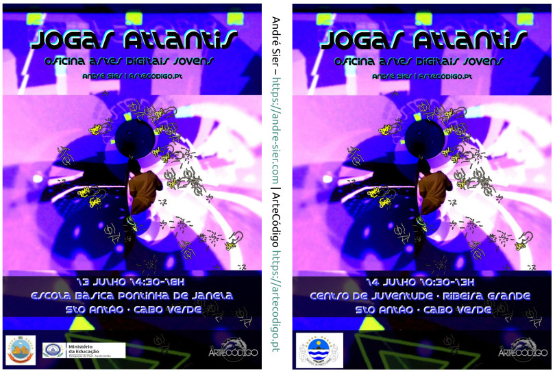
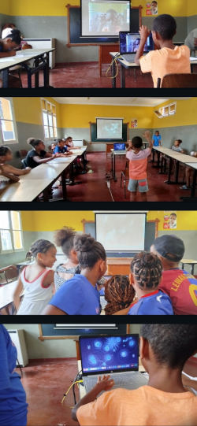
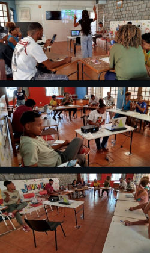

# Workshop-Jogar-Atlantis
Oficina participativa e de co-criação de conteúdos para videojogos Atlantis geolocalizados. Participatory workshop and co-creation of contents to the geolocated Atlantis videogames.

## Oficina 'Jogar Atlantis'

  

Uma oficina participativa, orientada por André Sier, com crianças e jovens das comunidades locais, onde os participantes dão os primeiros passos nas artes digitais, explorando software artístico e criando desenhos e fotografias digitais, aumentados divertidamente com elementos de código autoral. O tema é a lenda da Atlântida, e Cabo Verde, entre outros, como possíveis locais. O tema relaciona a mitologia associada a seres marinhos encantados, trabalhados em artes imaginárias, e às tradições orais e escritas dos locais onde a oficina se (in)screve, neste primeiro caso, de Cabo Verde. Os desenhos e fotografias produzidos na oficina são integrados directamente na obra 'Atlantis Cabo Verde': tornam-se formas do espaço imersivo, habitantes do mundo subaquático, geometria de um mundo mítico. Os participantes são co-criadores de secções da obra e serão creditados dentro do videojogo. A oficina é inteiramente gratuita e não requer qualquer experiência digital prévia.

Os resultados são integrados na obra geolocalizada, sendo os participantes co-criadores, onde o tema é a lenda da Atlântida entrecruzada com tradições locais, que muitas vezes reportam seres imaginários e encantados, a mitologia enredada com a história emergente proveniente de gerações e gerações e gerações.

Descarregue [aqui](m/Jogar-Atlantis-wksAndreSier2026.pdf) o PDF da apresentação da oficina 'Jogar Atlantis' que serve de mote à co-criação com os participantes. Para a co-criação dos elementos para a obra geolocalizada são disponibilizadas folhas de papel e lápis ou canetas, bem como programas desenvolvidos para as criações do artista em plataformas open-source que desenham com som, movimentos efectuados frente à webcam, com o rato, divertidamente aumentados com vários algoritmos, numa folha digital vazia, ou partindo de fotogramas obturados e registados digitalmente.

## Workshop 'Playing Atlantis'

  

A participatory workshop, led by André Sier, with children and young people from local communities, where participants take their first steps in digital arts, exploring artistic software and creating digital drawings and photographs, playfully enhanced with elements of authorial code. The theme is the legend of Atlantis, and Cape Verde, among others, as possible locations. The theme connects the mythology associated with enchanted sea creatures, worked into imaginary arts, and the oral and written traditions of the places where the workshop takes place, in this first case, Cape Verde. The drawings and photographs produced in the workshop are directly integrated into the work 'Atlantis Cabo Verde': they become forms of immersive space, inhabitants of the underwater world, geometry of a mythical world. Participants are co-creators of sections of the work and will be credited within the video game. The workshop is entirely free and requires no prior digital experience.

The results are integrated into the geolocated artwork, with participants acting as co-creators. The theme is the legend of Atlantis intertwined with local traditions, which often recount imaginary and enchanted beings, mythology intertwined with the emerging history passed down through generations.

Download [here](m/Jogar-Atlantis-wksAndreSier2026.pdf) the PDF of the 'Playing Atlantis' workshop presentation, which serves as a starting point for co-creation with the participants. For the co-creation of elements for the geolocated artwork, paper and pencils or pens are provided, as well as programs developed for the artist's creations on open-source platforms that draw with sound, movements made in front of the webcam, with the mouse, playfully enhanced with various algorithms, on a blank digital sheet, or starting from shuttered and digitally recorded frames.

## media

   
   

## Locais

202607 Cabo Verde, Sto Antão
  [+info residence&workshop (pt/en)](https://artecodigo.pt/b/Resid%C3%AAncia-Atlantis-Cabo-Verde-Oficinas-Jogar-Atlantis/)

## Copyright

Jogar Atlantis / Playing Atlantis

Copyright (c) 2016 André Sier, 2026- André Sier & ArteCódigo

## License

Ver/See [LICENSE](LICENSE)
